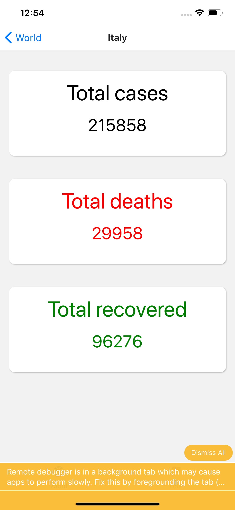

## COVID-19 Tracker

This app tracks cases in the world and the USA from two different APIs, https://covidtracking.com/ & https://thevirustracker.com/api/. I used tab navigation with World and USA as the bottom tabs. Within each tab there's stack navigation to show the respective country (world tab) or state (USA tab) and their cases, deaths, and recoveries.

There's over a hundred countries being tracked in the world list and 50 states + a few US territories (Puerto Rico, Guam, etc) in the USA list, and so I figured some sorting functionality would be beneficial to the user. There's sorting by cases and country/state name, as shown in the screenshots. For some reason, the rendering doesn't work well on the USA page and I wasn't able to pinpoint the issue to rerender the Flatlist, even though the data used is sorted fine when a button is clicked. 

This was simulated on an iPhone 11 Pro Max, and tested on an iPhone X. It's coded in React Native so ideally supported on Android but certainly wasn't optimized or developed with it in mind.

## Screenshots

### World & Sorting options

### Sorted by cases & country details

### USA & state details

I learned a lot in terms of multiple navigations, customizing headers and alerts, even small things like the icons used at the bottom. As of now, I just hard-coded a few states/countries to have a red down arrow or green up arrow to indicate rising cases. Ex. NY & CA have a green up arrow but ME has a red down arrow.

One frustrating thing was one of the APIs I used (for the World information) didn't return an array of countries like the array of states that the USA tab did. It instead returned an array of 2 items, one index being the API information and the other being 'countryitems'. I thought that countryitems would be an array of objects but instead it was just one object with multiple key-value pairs, so I went through some trouble debugging/deserializing that so I could render it into a Flatlist. However it prompted me to set up a local debugging / dev tools server with VS Code, so it was worthwhile.